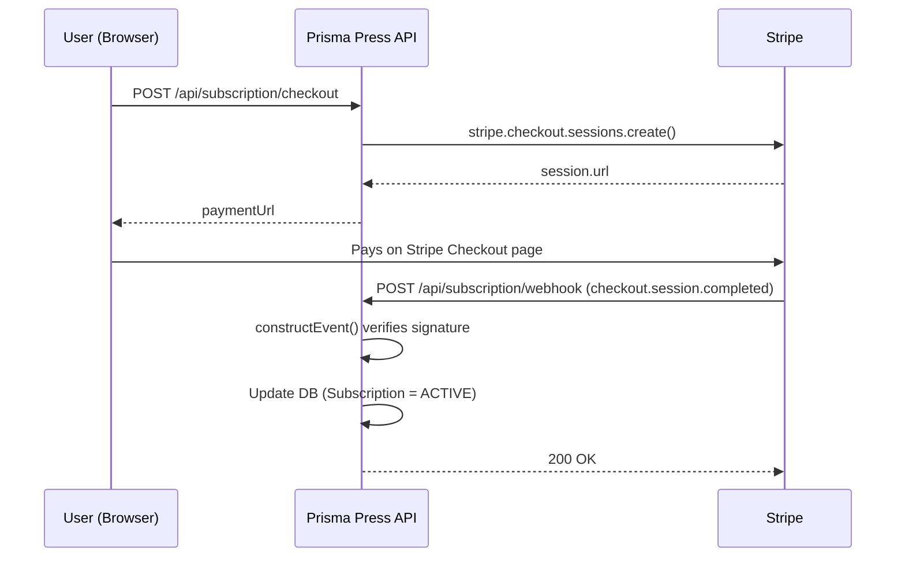
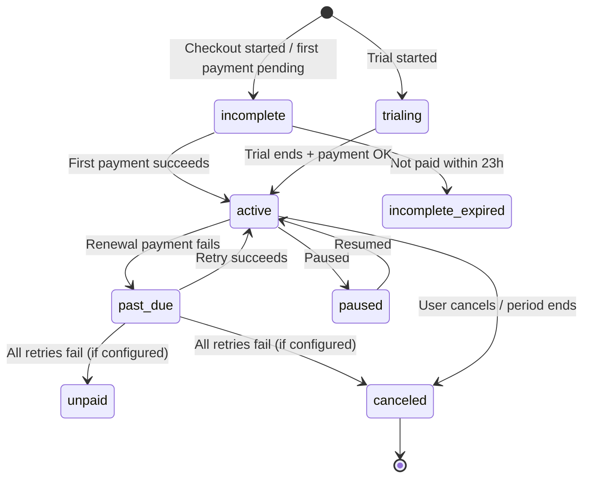

# 🔔 Stripe Webhook Event Types — Complete Guide

> **Module 24 Reference** | Prisma Press Backend
>
> From Beginner to Advanced, Step by Step
>
> Stack: Express 5 · TypeScript · Prisma 7 · `stripe@^23` · API version `2026-08-26.dahlia`

---

## 📑 Index

- [📌 What Is a Webhook Event?](#what-is-webhook)
- [🟦 PART 1: How Your Current Webhook Works](#part-1)
- [🟩 PART 2: Beginner: The Must-Know Events](#part-2)
  - [⭐ Production Minimum Checklist](#minimum-checklist)
  - [1. `checkout.session.completed`](#evt-checkout-completed)
  - [2. `checkout.session.expired`](#evt-checkout-expired)
  - [3. `invoice.paid`](#evt-invoice-paid)
  - [4. `invoice.payment_failed`](#evt-invoice-failed)
  - [5. `customer.subscription.deleted`](#evt-sub-deleted)
- [🟨 PART 3: Intermediate: Full Subscription Lifecycle](#part-3)
  - [Stripe subscription statuses](#sub-statuses)
  - [Mapping Stripe status to your Prisma enum](#status-mapping)
  - [6. `customer.subscription.created`](#evt-sub-created)
  - [7. `customer.subscription.updated`](#evt-sub-updated)
  - [8. `customer.subscription.trial_will_end`](#evt-trial-will-end)
  - [9. `customer.subscription.paused` / `resumed`](#evt-sub-paused)
  - [10. `invoice.payment_action_required`](#evt-action-required)
  - [11. `invoice.upcoming`](#evt-invoice-upcoming)
  - [12. `invoice.finalized` / `invoice.created`](#evt-invoice-finalized)
- [🟧 PART 4: One-Time Payments, Refunds & Disputes](#part-4)
  - [13. `payment_intent.succeeded`](#evt-pi-succeeded)
  - [14. `payment_intent.payment_failed`](#evt-pi-failed)
  - [Other PaymentIntent events](#evt-pi-other)
  - [15. `checkout.session.async_payment_*`](#evt-async-payment)
  - [16. `charge.refunded` / `refund.updated`](#evt-refunded)
  - [17. `charge.dispute.created` / `closed`](#evt-dispute)
  - [Customer & payment method events](#evt-customer)
- [🟥 PART 5: Advanced: Type-Safe Webhook Handler](#part-5)
- [🟪 PART 6: Production-Level Best Practices](#part-6)
- [🧪 PART 7: Testing Every Event Locally](#part-7)
  - [Handy test cards](#test-cards)
- [📋 Quick Reference Cheat Sheet](#cheat-sheet)
- [🧠 Key Takeaways](#key-takeaways)
- [✅ All Necessary Event Types (Short List)](#all-events)

---

<a id="what-is-webhook"></a>

## 📌 What Is a Webhook Event?

A **webhook** is an HTTP `POST` request that **Stripe sends to your server** when something happens in your Stripe account.

Here's an analogy:
- **Polling** is like phoning the shop every 5 minutes to ask, *"Is my order ready?"*
- **Webhook** is like the shop phoning **you** when the order is ready.

Each request carries an **Event** object:

```json
{
  "id": "evt_3UNFZURmLldBvByZ1tcFyIMM",
  "object": "event",
  "type": "payment_intent.succeeded",
  "created": 1791221465,
  "livemode": false,
  "data": {
    "object": { "id": "pi_123", "amount": 2000, "status": "succeeded" },
    "previous_attributes": {}
  }
}
```

| Field | Meaning |
|-------|---------|
| `id` | Unique event ID (`evt_...`). Use it for **idempotency** (see Part 6) |
| `type` | What happened, e.g. `invoice.paid` |
| `created` | Unix timestamp in **seconds** |
| `data.object` | The **resource** the event is about (Session, Subscription, Invoice...) |
| `data.previous_attributes` | Only on `*.updated` events. It holds the **old values** of fields that changed |
| `livemode` | `false` for test/sandbox, `true` for real money |

### Event naming pattern

```
<resource>.<action>
checkout.session.completed
customer.subscription.updated
invoice.payment_failed
```

---

<a id="part-1"></a>

## 🟦 PART 1: How Your Current Webhook Works

This is the flow in `src/app.ts`:



### Golden rules (you already follow #1 and #2 ✅)

1. **Use the raw body.** `stripe.webhooks.constructEvent()` needs the exact bytes Stripe sent, so register the webhook route with `express.raw()` **before** `app.use(express.json())`.
2. **Verify the signature** with `STRIPE_WEBHOOK_SECRET`. Without this check, anyone could `POST` a fake "payment succeeded" event to your server.
3. **Return `2xx` quickly** (within a few seconds). Anything else and Stripe **retries**.
4. **Be idempotent.** Stripe can deliver the **same event more than once**.
5. **Don't rely on order.** `invoice.paid` might arrive **before** `checkout.session.completed`.

---

<a id="part-2"></a>

## 🟩 PART 2: Beginner: The Must-Know Events

These are the events you **must** handle for a subscription app like Prisma Press.

<a id="minimum-checklist"></a>

### ⭐ Production Minimum Checklist (Subscriptions)

| # | Event | Why you need it |
|---|-------|-----------------|
| 1 | `checkout.session.completed` | User finished Checkout, so **link** the Stripe customer/subscription to your user |
| 2 | `customer.subscription.created` | A subscription now exists in Stripe |
| 3 | `customer.subscription.updated` | Plan change, renewal, status change, cancel scheduled |
| 4 | `customer.subscription.deleted` | Subscription fully ended, so **revoke access** |
| 5 | `invoice.paid` | Payment collected (first payment **and every renewal**), so **grant/extend access** |
| 6 | `invoice.payment_failed` | Card declined at renewal, so notify the user (Stripe retries automatically) |
| 7 | `customer.subscription.trial_will_end` | Trial ends in 3 days, so send a reminder email (only if you use trials) |
| 8 | `invoice.payment_action_required` | Card needs 3D Secure, so ask the user to confirm the payment |

> 💡 If you handle only **#1, #3, #4, #5, #6**, you already have a working, production-safe subscription system.

---

<a id="evt-checkout-completed"></a>

### 1️⃣ `checkout.session.completed`

**When:** The customer finished the Stripe Checkout page successfully.

**`data.object` type:** `Stripe.Checkout.Session`

**Use it to:** Connect *"this Stripe customer/subscription"* to *"this user in my DB"*.
The connection works through the `metadata.userId` you set when you created the session.

```ts
case "checkout.session.completed": {
    const session = event.data.object; // Stripe.Checkout.Session

    const userId = session.metadata?.userId;
    const customerId = session.customer as string;        // "cus_..."
    const subscriptionId = session.subscription as string; // "sub_..." (mode: "subscription")

    if (!userId) {
        console.warn("checkout.session.completed without userId metadata");
        break;
    }

    // payment_status can be "paid", "unpaid" or "no_payment_required"
    if (session.payment_status === "paid") {
        console.log(`✅ User ${userId} subscribed. sub=${subscriptionId}`);
        // -> save customerId + subscriptionId on the user's Subscription row
    }
    break;
}
```

> ⚠️ **Beginner trap:** `session.metadata` is **not copied** to the Subscription automatically.
> If you also want `userId` on subscription events, pass it twice when you create the session:
>
> ```ts
> await stripe.checkout.sessions.create({
>     // ...
>     metadata: { userId: user.id },                       // on the Session
>     subscription_data: { metadata: { userId: user.id } } // on the Subscription ✅
> });
> ```

---

<a id="evt-checkout-expired"></a>

### 2️⃣ `checkout.session.expired`

**When:** The customer opened Checkout but never paid. Sessions expire after 24 hours by default.

**Use it to:** Clean up "pending" records or send a *"You left something behind"* email.

```ts
case "checkout.session.expired": {
    const session = event.data.object;
    console.log(`⌛ Checkout expired for user ${session.metadata?.userId}`);
    break;
}
```

---

<a id="evt-invoice-paid"></a>

### 3️⃣ `invoice.paid`

**When:** An invoice was paid. For subscriptions this fires on the **first payment** and on **every renewal** (monthly/yearly).

**`data.object` type:** `Stripe.Invoice`

**Use it to:** **Grant or extend access.** This is the most important event for recurring billing.

```ts
case "invoice.paid": {
    const invoice = event.data.object; // Stripe.Invoice

    // 🆕 Since API 2025-03-31 (basil), invoice.subscription moved here:
    const sub = invoice.parent?.subscription_details?.subscription;
    const subscriptionId = typeof sub === "string" ? sub : sub?.id;

    if (!subscriptionId) break; // one-off invoice, not a subscription

    console.log(`💰 Invoice ${invoice.id} paid: ${invoice.amount_paid / 100} ${invoice.currency}`);
    console.log(`   billing_reason = ${invoice.billing_reason}`);
    // "subscription_create" -> first payment
    // "subscription_cycle"  -> renewal
    // "subscription_update" -> plan change / proration
    break;
}
```

> 💡 **`invoice.paid` vs `invoice.payment_succeeded`:**
> `invoice.paid` also fires when an invoice is marked paid **out of band** (e.g. manually in the Dashboard), and it's the event Stripe recommends for provisioning.
> `invoice.payment_succeeded` fires only when an actual payment attempt succeeds. Pick **one**, normally `invoice.paid`.

---

<a id="evt-invoice-failed"></a>

### 4️⃣ `invoice.payment_failed`

**When:** A charge for an invoice failed (expired card, not enough funds...).

**Use it to:** Email the user *"Please update your card"*. **Don't revoke access right away.** Stripe **Smart Retries** will try again over the next few days.

```ts
case "invoice.payment_failed": {
    const invoice = event.data.object;
    console.log(`❌ Payment failed for ${invoice.customer_email}`);
    console.log(`   attempt #${invoice.attempt_count}, next retry: ${
        invoice.next_payment_attempt
            ? new Date(invoice.next_payment_attempt * 1000).toISOString()
            : "no more retries"
    }`);
    // -> send "update payment method" email with invoice.hosted_invoice_url
    break;
}
```

---

<a id="evt-sub-deleted"></a>

### 5️⃣ `customer.subscription.deleted`

**When:** The subscription has **actually ended**. That happens when:
- it was cancelled immediately, or
- the period ended after `cancel_at_period_end = true`, or
- every payment retry failed and your Dashboard settings say "cancel subscription".

**Use it to:** **Revoke premium access.**

```ts
case "customer.subscription.deleted": {
    const subscription = event.data.object; // Stripe.Subscription
    console.log(`🛑 Subscription ${subscription.id} ended (status=${subscription.status})`);
    // -> set DB status = CANCELLED
    break;
}
```

---

<a id="part-3"></a>

## 🟨 PART 3: Intermediate: Full Subscription Lifecycle

<a id="sub-statuses"></a>

### Stripe subscription statuses



| Stripe status | Meaning | Give access? |
|---------------|---------|--------------|
| `trialing` | In free trial | ✅ Yes |
| `active` | Paid and in good standing | ✅ Yes |
| `past_due` | Latest renewal failed, Stripe is retrying | ⚠️ Usually yes (grace period) |
| `incomplete` | First payment not done yet | ❌ No |
| `incomplete_expired` | First payment never completed | ❌ No |
| `unpaid` | Retries exhausted, invoices left open | ❌ No |
| `canceled` | Ended | ❌ No |
| `paused` | Paused (trial ended without payment method, or paused manually) | ❌ No |

<a id="status-mapping"></a>

### Mapping Stripe status to your Prisma enum

Your `SubscriptionStatus` enum is `ACTIVE | CANCELLED | EXPIRED`:

```ts
import Stripe from "stripe";
import { SubscriptionStatus } from "../../../generated/prisma/enums";

export const mapStripeStatus = (
    status: Stripe.Subscription.Status
): SubscriptionStatus => {
    switch (status) {
        case "active":
        case "trialing":
        case "past_due": // grace period while Stripe retries
            return SubscriptionStatus.ACTIVE;
        case "canceled":
            return SubscriptionStatus.CANCELLED;
        case "incomplete":
        case "incomplete_expired":
        case "unpaid":
        case "paused":
        default:
            return SubscriptionStatus.EXPIRED;
    }
};
```

---

<a id="evt-sub-created"></a>

### 6️⃣ `customer.subscription.created`

**When:** A new subscription object is created. It is often `incomplete` at first, until the payment goes through.

```ts
case "customer.subscription.created": {
    const subscription = event.data.object;
    console.log(`🆕 Subscription ${subscription.id} created, status=${subscription.status}`);
    // Usually just upsert. The real "access granted" signal is invoice.paid / status=active
    break;
}
```

---

<a id="evt-sub-updated"></a>

### 7️⃣ `customer.subscription.updated`

**When:** **Anything** on the subscription changes: status, plan, quantity, a new billing period on renewal, `cancel_at_period_end`, and so on.

**Use it as your main "sync" event.** It is the most useful subscription event of all.

```ts
case "customer.subscription.updated": {
    const subscription = event.data.object;
    const previous = event.data.previous_attributes; // what changed

    // 🆕 Since API basil, the billing period lives on each subscription ITEM
    const periodEnd = subscription.items.data[0]?.current_period_end; // unix seconds

    // 1) User clicked "Cancel" -> keeps access until the period ends
    if (subscription.cancel_at_period_end && previous?.cancel_at_period_end === false) {
        console.log(`📅 Will cancel at ${new Date(periodEnd * 1000).toISOString()}`);
        // -> send "sorry to see you go" email, still ACTIVE in DB
    }

    // 2) User re-activated before the period ended
    if (!subscription.cancel_at_period_end && previous?.cancel_at_period_end === true) {
        console.log("🎉 Cancellation reverted");
    }

    // 3) Status changed (e.g. active -> past_due)
    if (previous?.status) {
        console.log(`🔁 Status: ${previous.status} -> ${subscription.status}`);
    }

    // 4) Plan changed
    if (previous?.items) {
        console.log(`📦 New price: ${subscription.items.data[0]?.price.id}`);
    }

    // -> Sync DB: status + currentPeriodEnd
    break;
}
```

> ⚠️ **API version note (you're on `2026-08-26.dahlia`):**
> `subscription.current_period_end` **no longer exists** on the Subscription object.
> Use `subscription.items.data[0].current_period_end` instead. Older tutorials show the old field.

---

<a id="evt-trial-will-end"></a>

### 8️⃣ `customer.subscription.trial_will_end`

**When:** **3 days before** a trial ends. If the trial is shorter than 3 days, it fires as soon as the trial starts.

```ts
case "customer.subscription.trial_will_end": {
    const subscription = event.data.object;
    const trialEnd = new Date(subscription.trial_end! * 1000);
    console.log(`⏰ Trial ends on ${trialEnd.toDateString()}`);
    // -> email: "Your trial ends soon, add a payment method"
    break;
}
```

---

<a id="evt-sub-paused"></a>

### 9️⃣ `customer.subscription.paused` / `customer.subscription.resumed`

**When:** A subscription is paused (for example, a trial ended without a payment method when `trial_settings.end_behavior.missing_payment_method = "pause"`) or resumed.

```ts
case "customer.subscription.paused":
    // -> revoke access temporarily
    break;
case "customer.subscription.resumed":
    // -> restore access
    break;
```

---

<a id="evt-action-required"></a>

### 🔟 `invoice.payment_action_required`

**When:** The bank requires **3D Secure / SCA** authentication. This is common with EU and Indian cards.

```ts
case "invoice.payment_action_required": {
    const invoice = event.data.object;
    // Send the user to Stripe's hosted page to authenticate
    console.log(`🔐 Action required: ${invoice.hosted_invoice_url}`);
    break;
}
```

---

<a id="evt-invoice-upcoming"></a>

### 1️⃣1️⃣ `invoice.upcoming`

**When:** A few days before a renewal. The number of days is set in Dashboard → Billing → Subscriptions → *Upcoming renewal events*.

**Use it to:** Send a *"You'll be charged $X on DATE"* email, or add one-time items to the next invoice.

> Note: the invoice in this event is a **preview** and has **no `id`**, so don't save it as a real invoice.

---

<a id="evt-invoice-finalized"></a>

### 1️⃣2️⃣ `invoice.finalized` / `invoice.created`

| Event | When | Typical use |
|-------|------|-------------|
| `invoice.created` | Draft invoice created (about 1h before it's finalized) | Add extra line items |
| `invoice.finalized` | Invoice is final and ready to pay | Store the invoice PDF link (`invoice.invoice_pdf`) |

---

<a id="part-4"></a>

## 🟧 PART 4: One-Time Payments, Refunds & Disputes

<a id="evt-pi-succeeded"></a>

### 1️⃣3️⃣ `payment_intent.succeeded`

**When:** A payment was successfully captured. It's the core event for **one-time payments** (`mode: "payment"`).

This is what `stripe trigger payment_intent.succeeded` sends, and why your CLI shows `charge.succeeded`, `payment_intent.created`, `payment_intent.succeeded` and `charge.updated` together.

```ts
case "payment_intent.succeeded": {
    const paymentIntent = event.data.object; // Stripe.PaymentIntent
    console.log(`✅ ${paymentIntent.amount / 100} ${paymentIntent.currency} received`);
    // -> fulfil the order (one-time purchase)
    break;
}
```

> 💡 For **subscriptions**, prefer `invoice.paid`. A PaymentIntent doesn't tell you directly which subscription it belongs to.

---

<a id="evt-pi-failed"></a>

### 1️⃣4️⃣ `payment_intent.payment_failed`

```ts
case "payment_intent.payment_failed": {
    const pi = event.data.object;
    const reason = pi.last_payment_error?.message ?? "Unknown error";
    console.log(`❌ Payment failed: ${reason}`);
    break;
}
```

<a id="evt-pi-other"></a>

### Other PaymentIntent events

| Event | Meaning |
|-------|---------|
| `payment_intent.created` | Intent created. Usually ignore it |
| `payment_intent.processing` | Async method (bank debit) in progress. Show "processing" |
| `payment_intent.requires_action` | 3DS needed |
| `payment_intent.canceled` | Intent canceled. Release any reserved stock |

---

<a id="evt-async-payment"></a>

### 1️⃣5️⃣ `checkout.session.async_payment_succeeded` / `async_payment_failed`

**When:** You use **delayed payment methods** (ACH, SEPA, Boleto...). In that case `checkout.session.completed` fires with `payment_status: "unpaid"`, and the final result comes later through these events.

```ts
case "checkout.session.completed": {
    const session = event.data.object;
    if (session.payment_status === "paid") await fulfil(session);
    // else wait for async_payment_succeeded
    break;
}
case "checkout.session.async_payment_succeeded":
    await fulfil(event.data.object);
    break;
case "checkout.session.async_payment_failed":
    // notify user
    break;
```

> With `allowed_payment_method_types: ["card"]` (your current setup) you don't need these, but they matter in production if you add bank payments.

---

<a id="evt-refunded"></a>

### 1️⃣6️⃣ `charge.refunded` / `refund.updated`

**When:** Money was returned to the customer, fully or partly.

```ts
case "charge.refunded": {
    const charge = event.data.object; // Stripe.Charge
    const fullyRefunded = charge.amount_refunded === charge.amount;
    console.log(`↩️ Refunded ${charge.amount_refunded / 100}, full=${fullyRefunded}`);
    // -> if full refund on a subscription payment, consider revoking access
    break;
}
```

---

<a id="evt-dispute"></a>

### 1️⃣7️⃣ `charge.dispute.created` / `charge.dispute.closed`

**When:** The customer **disputed** the charge with their bank (a chargeback). You have a deadline to respond.

```ts
case "charge.dispute.created": {
    const dispute = event.data.object; // Stripe.Dispute
    console.log(`🚨 Dispute ${dispute.id}: reason=${dispute.reason}, amount=${dispute.amount / 100}`);
    console.log(`   respond by: ${new Date(dispute.evidence_details.due_by! * 1000).toISOString()}`);
    // -> alert admin (Slack/email), optionally suspend the account
    break;
}
case "charge.dispute.closed": {
    const dispute = event.data.object;
    console.log(`Dispute closed: ${dispute.status}`); // "won" | "lost" | ...
    break;
}
```

> 🔥 **Production must-have.** Too many disputes can get your Stripe account restricted.

---

<a id="evt-customer"></a>

### Customer & payment method events

| Event | Use case |
|-------|----------|
| `customer.created` | Usually ignore (you create the customer yourself) |
| `customer.updated` | Sync email/name changes made in the Customer Portal |
| `customer.deleted` | Remove `stripeCustomerId` from your DB |
| `payment_method.attached` | Card saved to a customer |
| `payment_method.detached` | Card removed |
| `setup_intent.succeeded` | Card saved without charging (e.g. trial with card) |

---

<a id="part-5"></a>

## 🟥 PART 5: Advanced: Type-Safe Webhook Handler

### Step 1: Type the event (no more `any`)

Right now `let event = request.body;` is typed as `any`. Give it the `Stripe.Event` type. A `switch` on `event.type` then **narrows** `event.data.object` automatically:

```ts
import Stripe from "stripe";

let event: Stripe.Event;
try {
    event = stripe.webhooks.constructEvent(request.body, signature, endpointSecret);
} catch (err: any) {
    return response.status(400).json({ message: err.message });
}

switch (event.type) {
    case "invoice.paid":
        event.data.object; // ✅ TypeScript knows: Stripe.Invoice
        break;
    case "customer.subscription.updated":
        event.data.object; // ✅ Stripe.Subscription
        break;
}
```

---

### Step 2: Handler map pattern (clean and scalable)

Large `switch` blocks become hard to maintain. Map each event type to its own function instead:

```ts
// src/modules/webhook/webhook.handlers.ts
import Stripe from "stripe";

type EventOf<T extends Stripe.Event.Type> = Extract<Stripe.Event, { type: T }>;
type Handler<T extends Stripe.Event.Type> = (event: EventOf<T>) => Promise<void>;
type HandlerMap = { [K in Stripe.Event.Type]?: Handler<K> };

export const webhookHandlers: HandlerMap = {
    "checkout.session.completed": async (event) => {
        const session = event.data.object; // Stripe.Checkout.Session ✅
        // ...
    },
    "invoice.paid": async (event) => {
        const invoice = event.data.object; // Stripe.Invoice ✅
        // ...
    },
    "customer.subscription.deleted": async (event) => {
        // ...
    },
};

export const dispatchStripeEvent = async (event: Stripe.Event) => {
    const handler = webhookHandlers[event.type] as Handler<typeof event.type> | undefined;
    if (!handler) {
        console.log(`ℹ️ Unhandled event type: ${event.type}`);
        return;
    }
    await handler(event as never);
};
```

---

### Step 3: Real DB sync with Prisma

> 📝 You first need `stripeSubscriptionId String? @unique` on your `Subscription` model.
> It's currently commented out in `prisma/schema/subscription.prisma`.

```ts
// src/modules/webhook/webhook.service.ts
import Stripe from "stripe";
import { prisma } from "../../lib/prisma";
import { stripe } from "../../lib/stripe";
import { mapStripeStatus } from "./webhook.utils";

/**
 * Single source of truth: always re-fetch the latest subscription from Stripe.
 * This solves out-of-order events, because whatever arrives, we save the CURRENT state.
 */
export const syncSubscription = async (subscriptionId: string) => {
    const subscription = await stripe.subscriptions.retrieve(subscriptionId);

    const customerId =
        typeof subscription.customer === "string"
            ? subscription.customer
            : subscription.customer.id;

    const periodEnd = subscription.items.data[0]?.current_period_end;

    await prisma.subscription.update({
        where: { stripeCustomerId: customerId },
        data: {
            stripeSubscriptionId: subscription.id,
            status: mapStripeStatus(subscription.status),
            currentPeriodEnd: new Date(periodEnd * 1000),
        },
    });
};

export const handleCheckoutCompleted = async (session: Stripe.Checkout.Session) => {
    const userId = session.metadata?.userId;
    const customerId = session.customer as string;
    const subscriptionId = session.subscription as string;
    if (!userId || !subscriptionId) return;

    const subscription = await stripe.subscriptions.retrieve(subscriptionId);
    const periodEnd = subscription.items.data[0]?.current_period_end;

    // upsert = safe if the event is delivered twice
    await prisma.subscription.upsert({
        where: { userId },
        create: {
            userId,
            stripeCustomerId: customerId,
            stripeSubscriptionId: subscriptionId,
            status: mapStripeStatus(subscription.status),
            currentPeriodEnd: new Date(periodEnd * 1000),
        },
        update: {
            stripeCustomerId: customerId,
            stripeSubscriptionId: subscriptionId,
            status: mapStripeStatus(subscription.status),
            currentPeriodEnd: new Date(periodEnd * 1000),
        },
    });
};
```

Then the handlers stay tiny:

```ts
"customer.subscription.created": (e) => syncSubscription(e.data.object.id),
"customer.subscription.updated": (e) => syncSubscription(e.data.object.id),
"customer.subscription.deleted": (e) => syncSubscription(e.data.object.id),
"invoice.paid": async (e) => {
    const sub = e.data.object.parent?.subscription_details?.subscription;
    if (sub) await syncSubscription(typeof sub === "string" ? sub : sub.id);
},
```

---

<a id="part-6"></a>

## 🟪 PART 6: Production-Level Best Practices

### 1. Idempotency: process every event only once

Stripe guarantees **at-least-once** delivery, so duplicates do happen. Store processed event IDs:

```prisma
// prisma/schema/stripeEvent.prisma
model StripeEvent {
    id          String   @id          // evt_...
    type        String
    processedAt DateTime @default(now())

    @@map("stripe_events")
}
```

```ts
import { Prisma } from "../../generated/prisma/client";

export const processOnce = async (event: Stripe.Event, fn: () => Promise<void>) => {
    try {
        await prisma.stripeEvent.create({ data: { id: event.id, type: event.type } });
    } catch (err) {
        if (err instanceof Prisma.PrismaClientKnownRequestError && err.code === "P2002") {
            console.log(`🔁 Duplicate event ${event.id}, skipping`);
            return; // already processed
        }
        throw err;
    }

    try {
        await fn();
    } catch (err) {
        // roll back the marker so Stripe's retry can process it again
        await prisma.stripeEvent.delete({ where: { id: event.id } });
        throw err;
    }
};
```

### 2. Respond fast and return the correct status code

```ts
try {
    await processOnce(event, () => dispatchStripeEvent(event));
    return response.status(200).json({ received: true });
} catch (err) {
    console.error(`Webhook handler failed for ${event.id}`, err);
    return response.status(500).json({ received: false }); // Stripe will retry ✅
}
```

| Return | Stripe's reaction |
|--------|-------------------|
| `2xx` | ✅ Delivered, no retry |
| `4xx` / `5xx` / timeout | 🔁 Retries with exponential backoff for up to **3 days** (live mode) |
| Bad signature, so `400` | Correct. This was a fake or misconfigured request |

> 💡 For heavy work (emails, PDFs, AI calls), push the event to a **queue** (BullMQ, SQS...) and return `200` right away.

### 3. Handle out-of-order events

- ❌ Don't assume `checkout.session.completed` arrives before `invoice.paid`.
- ✅ Use **upsert** instead of `update`.
- ✅ **Re-fetch** the object from the Stripe API (`syncSubscription`) instead of trusting the event snapshot.
- ✅ Or compare `event.created` with the `lastEventAt` value you stored.

### 4. Subscribe only to the events you need

In **Dashboard → Developers → Webhooks → Add endpoint**, select only the events you handle. You get less traffic and less noise.

Locally:

```bash
stripe listen \
  --events checkout.session.completed,customer.subscription.created,customer.subscription.updated,customer.subscription.deleted,invoice.paid,invoice.payment_failed \
  --forward-to localhost:3000/api/subscription/webhook
```

### 5. Separate secrets per environment

| Environment | Secret source |
|-------------|---------------|
| Local | `whsec_...` printed by `stripe listen` (stays the same per machine/account) |
| Staging / Production | `whsec_...` from the Dashboard endpoint page (a **different** value!) |

> ⚠️ A common production bug is deploying with the **CLI** secret. Every event then fails with *"No signatures found matching the expected signature"*.

### 6. Security checklist

- ✅ Always call `constructEvent()`. Never trust `request.body` without verifying it.
- ✅ Never log full card/customer PII.
- ✅ Check `event.livemode` if test and live share infrastructure.
- ✅ Don't put the webhook route behind your `auth()` middleware. Stripe has no JWT.
- ✅ Keep `express.raw()` **only** on the webhook route.

### 7. Snapshot vs Thin events (newer Stripe feature)

| | Snapshot events (classic, v1) | Thin events (v2) |
|--|-------------------------------|------------------|
| Payload | Full object in `data.object` | Only IDs, so you fetch the object |
| Parse with | `stripe.webhooks.constructEvent()` | `stripe.parseThinEvent()` / event notifications |
| Used for | All events in this guide | Newer v2 APIs (e.g. billing meters, accounts v2) |

Your `--all-snapshot` CLI flag forwards **snapshot** events, which is what this guide covers.

---

<a id="part-7"></a>

## 🧪 PART 7: Testing Every Event Locally

**Terminal 1: server**
```bash
npm run dev
```

**Terminal 2: forward events**
```bash
npm run stripe:webhook
```

**Terminal 3: trigger events**
```bash
stripe trigger checkout.session.completed
stripe trigger customer.subscription.created
stripe trigger customer.subscription.updated
stripe trigger customer.subscription.deleted
stripe trigger customer.subscription.trial_will_end
stripe trigger invoice.paid
stripe trigger invoice.payment_failed
stripe trigger invoice.payment_action_required
stripe trigger payment_intent.succeeded
stripe trigger payment_intent.payment_failed
stripe trigger charge.refunded
stripe trigger charge.dispute.created
```

**Useful extras:**
```bash
stripe trigger --help                    # list all supported triggers
stripe events resend evt_123             # resend a specific event
stripe logs tail                         # live API request logs
```

> ⚠️ Triggered fixtures create **random** customers with **no `metadata.userId`**, so your handler must handle missing metadata gracefully. For a true end-to-end test, run the real Checkout flow with test card `4242 4242 4242 4242`.

<a id="test-cards"></a>

### Handy test cards

| Card | Result |
|------|--------|
| `4242 4242 4242 4242` | ✅ Success |
| `4000 0000 0000 0341` | Attaches OK, then **fails at charge** (simulates renewal failure) |
| `4000 0025 0000 3155` | 🔐 Requires 3D Secure |
| `4000 0000 0000 9995` | ❌ Insufficient funds |
| `4000 0000 0000 0259` | 🚨 Creates a dispute |

---

<a id="cheat-sheet"></a>

## 📋 Quick Reference Cheat Sheet

| Event | Object | Action in Prisma Press | Priority |
|-------|--------|------------------------|----------|
| `checkout.session.completed` | Checkout.Session | Link customer + subscription to user | 🔴 Must |
| `customer.subscription.created` | Subscription | Upsert subscription | 🟠 Recommended |
| `customer.subscription.updated` | Subscription | Sync status + period end | 🔴 Must |
| `customer.subscription.deleted` | Subscription | Set `CANCELLED`, revoke access | 🔴 Must |
| `invoice.paid` | Invoice | Extend access (renewals) | 🔴 Must |
| `invoice.payment_failed` | Invoice | Email "update card" | 🔴 Must |
| `invoice.payment_action_required` | Invoice | Email 3DS link | 🟠 Recommended |
| `customer.subscription.trial_will_end` | Subscription | Trial reminder email | 🟡 If trials |
| `invoice.upcoming` | Invoice (preview) | Renewal reminder email | 🟡 Optional |
| `checkout.session.expired` | Checkout.Session | Abandoned-cart email | 🟡 Optional |
| `checkout.session.async_payment_*` | Checkout.Session | Delayed payment result | 🟡 If bank payments |
| `payment_intent.succeeded` | PaymentIntent | Fulfil one-time order | 🟠 If one-time |
| `payment_intent.payment_failed` | PaymentIntent | Notify user | 🟠 If one-time |
| `charge.refunded` | Charge | Revoke / adjust access | 🟠 Recommended |
| `charge.dispute.created` | Dispute | Alert admin | 🔴 Must (live) |
| `customer.updated` / `deleted` | Customer | Sync / clean up | 🟡 Optional |

---

<a id="key-takeaways"></a>

## 🧠 Key Takeaways

1. **`checkout.session.completed`** links Stripe to your user.
2. **`invoice.paid`** is the "money arrived" signal, and it fires on every renewal.
3. **`customer.subscription.updated` / `deleted`** keep your DB status in sync.
4. Always **verify the signature**, **return 2xx fast**, be **idempotent**, and **don't trust event order**.
5. On API `dahlia`/`basil`+, read `current_period_end` from **subscription items**, and get the invoice's subscription from **`invoice.parent.subscription_details`**.

---

<a id="all-events"></a>

## ✅ All Necessary Event Types (Short List)

### 🔴 Must-Have

1. `checkout.session.completed`: user paid on Checkout, so link them to the Stripe customer/subscription
2. `customer.subscription.updated`: sync status, plan and period end
3. `customer.subscription.deleted`: subscription ended, so revoke access
4. `invoice.paid`: payment received (first + every renewal), so grant/extend access
5. `invoice.payment_failed`: renewal failed, so ask the user to update their card
6. `charge.dispute.created`: chargeback opened, so alert the admin (live mode)

### 🟠 Recommended

7. `customer.subscription.created`: subscription created, so upsert it in the DB
8. `invoice.payment_action_required`: 3D Secure needed, so send the confirm link
9. `charge.refunded`: money returned, so adjust or revoke access
10. `payment_intent.succeeded`: one-time payment succeeded, so fulfil the order
11. `payment_intent.payment_failed`: one-time payment failed, so notify the user

### 🟡 Optional / Situational

12. `customer.subscription.trial_will_end`: trial ends in 3 days, so send a reminder
13. `customer.subscription.paused` / `resumed`: pause or restore access
14. `invoice.upcoming`: renewal coming soon, so send a reminder
15. `invoice.created` / `invoice.finalized`: add line items / store the invoice PDF
16. `checkout.session.expired`: checkout abandoned, so send a reminder email
17. `checkout.session.async_payment_succeeded` / `async_payment_failed`: result of a delayed bank payment
18. `charge.dispute.closed`: dispute won or lost
19. `refund.updated`: refund status changed
20. `customer.updated` / `customer.deleted`: sync or clean up customer data
21. `payment_method.attached` / `detached`: card saved or removed
22. `setup_intent.succeeded`: card saved without a charge

### 📋 Copy-Paste: Must-Have Events for `stripe listen`

```bash
stripe listen --events checkout.session.completed,customer.subscription.created,customer.subscription.updated,customer.subscription.deleted,invoice.paid,invoice.payment_failed,invoice.payment_action_required,charge.refunded,charge.dispute.created --forward-to localhost:3000/api/subscription/webhook
```
