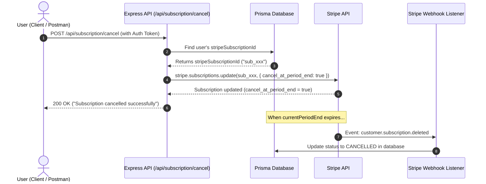

# 🛑 Stripe Subscription Cancellation: Beginner to Pro Guide

> A complete, beginner-friendly guide explaining how subscription cancellation works in **Stripe**, how to implement it in **Node.js/Express with Prisma**, and how to handle database updates seamlessly.

---

## 📑 Table of Contents

1. [Beginner Concept: What is Subscription Cancellation?](#1-beginner-concept-what-is-subscription-cancellation)
2. [The Two Ways to Cancel in Stripe](#2-the-two-ways-to-cancel-in-stripe)
3. [The Complete Flow (Architecture Diagram)](#3-the-complete-flow-architecture-diagram)
4. [Layer-by-Layer Code Implementation](#4-layer-by-layer-code-implementation)
   - [Step 1: Route Layer](#step-1-route-layer-subscriptionroutets)
   - [Step 2: Controller Layer](#step-2-controller-layer-subscriptioncontrollerts)
   - [Step 3: Service Layer (The Core Logic)](#step-3-service-layer-subscriptionservicets)
5. [The Customer ID vs Subscription ID Trap ⚠️](#5-the-customer-id-vs-subscription-id-trap-️)
6. [How Webhooks Finish the Job Automatically](#6-how-webhooks-finish-the-job-automatically)
7. [Protecting Premium Content: Subscription Guard](#7-protecting-premium-content-subscription-guard)
8. [Common Beginner Mistakes & Solutions](#8-common-beginner-mistakes--solutions)
9. [How to Test Locally](#9-how-to-test-locally)
10. [Cheat Sheet & Quick Summary](#10-cheat-sheet--quick-summary)

---

## 1. Beginner Concept: What is Subscription Cancellation?

Imagine you subscribe to **Netflix** on **October 1st** for **$10/month**. Your subscription is valid until **October 31st**.

On **October 10th**, you decide you don't want Netflix next month, so you click **"Cancel Subscription"**.

### What should happen?
- ❌ **Bad Experience:** Netflix locks you out instantly on Oct 10th, even though you paid for the whole month!
- ✅ **Good Experience (Standard SaaS):** Netflix lets you watch movies until **October 31st**. On November 1st, your card is **not charged**, and your account becomes **inactive**.

This is why subscription cancellation has two different approaches.

---

## 2. The Two Ways to Cancel in Stripe

| Feature | Method 1: Cancel at Period End (Default SaaS) | Method 2: Cancel Immediately |
| :--- | :--- | :--- |
| **Stripe Method** | `stripe.subscriptions.update(id, { cancel_at_period_end: true })` | `stripe.subscriptions.cancel(id)` |
| **Status in Stripe right now** | Stays `'active'` until cycle ends | Changes immediately to `'canceled'` |
| **User access** | Retained until `currentPeriodEnd` | Cut off right now |
| **Future charges** | None (auto-renewal stopped) | None |
| **Best used for** | Normal users clicking "Cancel My Plan" | Policy violation, fraud, chargebacks, instant refunds |

In this project, we implement **Method 1 (Cancel at Period End)** because it is the fairest and standard way for web applications.

---

## 3. The Complete Flow (Architecture Diagram)

Here is how all the pieces in our project talk to each other:



---

## 4. Layer-by-Layer Code Implementation

### Step 1: Route Layer (`subscription.route.ts`)

We protect the route using our `auth` middleware so only logged-in users can cancel their own subscription.

```typescript
// src/modules/subscription/subscription.route.ts
import { Router } from "express";
import { subscriptionController } from "./subscription.controller";
import { Role } from "../../../generated/prisma/enums";
import { auth } from "../../middlewares/auth";

const router = Router();

// POST /api/subscription/cancel
router.post(
    '/cancel',
    auth(Role.USER, Role.ADMIN, Role.AUTHOR), // 🔒 Must be logged in
    subscriptionController.cancelSubscription
);

export const subscriptionRoutes = router;
```

---

### Step 2: Controller Layer (`subscription.controller.ts`)

The controller extracts the `userId` from `req.user` (added by JWT auth) and passes it to the service layer.

```typescript
// src/modules/subscription/subscription.controller.ts
import { Request, Response } from "express";
import { catchAsync } from "../../utils/catchAsync";
import { sendResponse } from "../../utils/sendResponse";
import { subscriptionServices } from "./subscription.service";
import httpStatus from "http-status";

const cancelSubscription = catchAsync(async (req: Request, res: Response) => {
    // 1. Get logged-in user id from JWT payload
    const userId = req.user?.id;

    // 2. Call service function
    const result = await subscriptionServices.cancelSubscription(userId as string);

    // 3. Send friendly response
    sendResponse(res, {
        statusCode: httpStatus.OK,
        success: true,
        message: "Subscription cancelled successfully",
        data: result
    });
});

export const subscriptionController = {
    // ...other controllers
    cancelSubscription
};
```

---

### Step 3: Service Layer (The Core Logic)

Here is where the cancellation logic lives in `subscription.service.ts`:

```typescript
// src/modules/subscription/subscription.service.ts
import { prisma } from "../../lib/prisma";
import { stripe } from "../../lib/stripe";
import { SubscriptionStatus } from "../../../generated/prisma/enums";

const cancelSubscription = async (userId: string) => {
    // 1. Check if the user has an existing subscription record
    const subscription = await prisma.subscription.findUniqueOrThrow({
        where: {
            userId
        }
    });

    // 2. Extract stripeSubscriptionId (NOT stripeCustomerId!)
    const { stripeSubscriptionId } = subscription;

    if (!stripeSubscriptionId) {
        throw new Error("No subscription found for the user");
    }

    // 3. Inform Stripe to stop auto-renewal at period end
    const canceledSubscription = await stripe.subscriptions.update(stripeSubscriptionId, {
        cancel_at_period_end: true
    });

    return canceledSubscription;
};
```

#### Line-by-Line Breakdown:

1. `prisma.subscription.findUniqueOrThrow({ where: { userId } })`:
   Looks up the user's subscription in Postgres. If no record is found, Prisma automatically throws an error with code `P2025` which `catchAsync` handles.
2. `const { stripeSubscriptionId } = subscription`:
   Retrieves the Stripe subscription ID (e.g., `sub_1Q1234...`).
3. `await stripe.subscriptions.update(stripeSubscriptionId, { cancel_at_period_end: true })`:
   Sends an API request to Stripe asking: *"Do not bill this subscription on the next cycle, but keep it active until the current period ends."*

---

## 5. The Customer ID vs Subscription ID Trap ⚠️

This is one of the most common errors for developers integrating Stripe:

```typescript
// ❌ WRONG - Passing Customer ID
const canceledSubscription = await stripe.subscriptions.update(stripeCustomerId, {
    cancel_at_period_end: true
});
// 💥 Error: StripeInvalidRequestError: No such subscription: 'cus_xxxxxx'
```

```typescript
// ✅ CORRECT - Passing Subscription ID
const canceledSubscription = await stripe.subscriptions.update(stripeSubscriptionId, {
    cancel_at_period_end: true
});
```

### Why?
Stripe prefixes all IDs so you can recognize what they represent:
- **`cus_...`** = Customer object (represents a person with email, cards, billing info).
- **`sub_...`** = Subscription object (represents an active recurring plan).
- `stripe.subscriptions.update()` specifically operates on **subscriptions**, so it requires an ID starting with `sub_`.

---

## 6. How Webhooks Finish the Job Automatically

When you set `cancel_at_period_end: true`, what happens to your database?

### Two phases of cancellation:

#### Phase 1: The Request (Immediate)
When `cancelSubscription` runs:
1. Stripe updates `cancel_at_period_end = true`.
2. Stripe sends a webhook: **`customer.subscription.updated`**.
3. In Stripe, `status` is **still `"active"`** because the user still has remaining days!

#### Phase 2: The Period End (When time runs out)
When the remaining days expire:
1. Stripe changes the subscription status from `"active"` to **`"canceled"`**.
2. Stripe sends a webhook: **`customer.subscription.deleted`**.
3. Our webhook listener receives this event and updates our database to **`CANCELLED`**!

### Our Webhook Handler in `subscription.utils.ts`:

```typescript
// src/modules/subscription/subscription.utils.ts
import Stripe from "stripe";
import { prisma } from "../../lib/prisma";
import { SubscriptionStatus } from "../../../generated/prisma/enums";

export const handleChangeSubscription = async (payload: Stripe.Subscription) => {
    const currentPeriodEnd = getPeriodEnd(payload);
    const stripeSubscriptionId = payload.id;
    const statusChecking = payload.status;

    // ⚠️ Remember: Stripe sends 'canceled' (1 'l'), our Prisma enum is CANCELLED (2 'l's)
    const status = (statusChecking === 'active' || statusChecking === 'trialing') 
        ? SubscriptionStatus.ACTIVE
        : statusChecking === 'canceled'
            ? SubscriptionStatus.CANCELLED
            : SubscriptionStatus.EXPIRED;

    // 1. Verify subscription exists in database
    const isSubscriptionExist = await prisma.subscription.findUnique({
        where: {
            stripeSubscriptionId
        }
    });

    if (!isSubscriptionExist) {
        console.log(`Webhook: Subscription not found for id: ${stripeSubscriptionId}`);
        return; // Guard to prevent Prisma crash
    }

    // 2. Update the status in our database
    await prisma.subscription.update({
        where: {
            stripeSubscriptionId
        },
        data: {
            status,
            currentPeriodEnd
        }
    });
};
```

In `subscription.service.ts`, both events are forwarded to this utility:

```typescript
// src/modules/subscription/subscription.service.ts
switch (event.type) {
    case 'customer.subscription.updated':
        await handleChangeSubscription(event.data.object as Stripe.Subscription);
        break;

    case 'customer.subscription.deleted':
        await handleChangeSubscription(event.data.object as Stripe.Subscription);
        break;
}
```

---

## 7. Protecting Premium Content: Subscription Guard

Now that users can cancel, how do we protect premium routes?

### Checking Status and Expiry Date

In `subscription.service.ts`, we have `getSubscriptionStatus`:

```typescript
const getSubscriptionStatus = async (userId: string) => {
    const subscription = await prisma.subscription.findUniqueOrThrow({
        where: { userId }
    });

    const { status, currentPeriodEnd } = subscription;

    // User is active IF status is ACTIVE AND current period end has not passed
    const isActive = status === SubscriptionStatus.ACTIVE && new Date(currentPeriodEnd) > new Date();

    return {
        status,
        currentPeriodEnd,
        isActive
    };
};
```

And in `src/middlewares/premiumGuard.ts`:

```typescript
export const subscriptionGuard = () => { 
    return catchAsync(async (req: Request, res: Response, next: NextFunction) => {
        const userId = req.user?.id;

        const subscription = await prisma.subscription.findUnique({
            where: { userId }
        });

        if (!subscription) {
            throw new Error("Please subscribe to get access to Premium Contents");
        }

        const isStillValid = 
            subscription.status === SubscriptionStatus.ACTIVE && 
            new Date(subscription.currentPeriodEnd) > new Date();

        if (!isStillValid) {
            throw new Error("Please subscribe again to get access to Premium Contents");
        }

        next();
    });
};
```

This guarantees that:
- While `cancel_at_period_end: true` is set, the user **still enjoys premium content** until their paid month ends.
- Once `currentPeriodEnd` passes, access is automatically blocked.

---

## 8. Common Beginner Mistakes & Solutions

### ❌ Mistake 1: Passing `stripeCustomerId` to subscription methods
```typescript
// Error: No such subscription: 'cus_xxxx'
await stripe.subscriptions.update(stripeCustomerId, { cancel_at_period_end: true });
```
**Fix:** Always pass `stripeSubscriptionId` (`sub_xxxx`).

---

### ❌ Mistake 2: Checking `'cancelled'` with two 'l's against Stripe payload
```typescript
// In Stripe SDK:
payload.status === 'cancelled' // ❌ Always false! Stripe uses American spelling 'canceled'
```
**Fix:**
```typescript
payload.status === 'canceled' ? SubscriptionStatus.CANCELLED : ...
```

---

### ❌ Mistake 3: Manually setting database to `CANCELLED` too early
If you set your database `status = "CANCELLED"` immediately upon calling `cancel_at_period_end: true`:
- The user paid for 30 days.
- They cancel on Day 5 to avoid next month's charge.
- Your app suddenly cuts off their access on Day 5! The user will complain and ask for a refund.

**Fix:** Leave the status as `ACTIVE` until `currentPeriodEnd`, or store a boolean `cancelAtPeriodEnd: true` in your database so your UI can display *"Your plan will end on Oct 31st"*.

---

### ❌ Mistake 4: Not returning early when a record doesn't exist
```typescript
if (!isSubscriptionExist) {
    console.log("Not found");
}
await prisma.subscription.update(...); // 💥 Crashes with Prisma error P2025!
```
**Fix:** Always `return` immediately if `!isSubscriptionExist`.

---

## 9. How to Test Locally

### 1. Start the Stripe Webhook Forwarder
In your terminal, run:
```bash
npm run stripe:webhook
```
*(This forwards events from Stripe servers to `http://localhost:3000/api/subscription/webhook`).*

### 2. Send the Cancel Request via Postman or ThunderClient
- **Method:** `POST`
- **URL:** `http://localhost:3000/api/subscription/cancel`
- **Headers:**
  - `Authorization`: `Bearer <YOUR_JWT_TOKEN>`
- **Response Expected:**
  ```json
  {
      "statusCode": 200,
      "success": true,
      "message": "Subscription cancelled successfully",
      "data": {
          "id": "sub_1Qxxxxxx",
          "cancel_at_period_end": true,
          "status": "active"
      }
  }
  ```

### 3. Check Stripe Dashboard
Open your **Stripe Dashboard (Test Mode)**:
- Go to **Billing** → **Subscriptions**.
- Click on the subscription.
- You will see a banner:
  > *"Cancels at the end of the current billing period on [Date]"*

---

## 10. Cheat Sheet & Quick Summary

```
Action                     Stripe Method                        Stripe Status   DB Status
─────────────────────────────────────────────────────────────────────────────────────────────
Start Subscription         stripe.checkout.sessions.create      active          ACTIVE
Cancel (End of Month)      stripe.subscriptions.update(subId)   active          ACTIVE (until end)
                           { cancel_at_period_end: true }
Time Expired               (automatic via webhook deleted)      canceled        CANCELLED
Cancel Immediately         stripe.subscriptions.cancel(subId)   canceled        CANCELLED
```

### Golden Takeaways:
1. **Subscriptions use `sub_xxx` IDs**, Customers use `cus_xxx` IDs.
2. `cancel_at_period_end: true` stops automatic renewal without stealing paid days from your user.
3. Stripe triggers `customer.subscription.deleted` when the period finally runs out.
4. Always check both `status === 'ACTIVE'` AND `currentPeriodEnd > new Date()` to ensure legitimate premium access.
