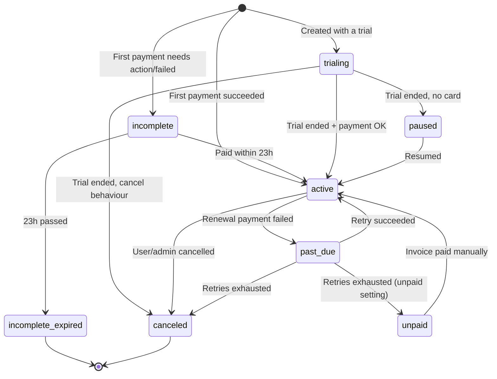

# 📘 Stripe Subscription Status: Beginner to Pro

> This guide explains **every subscription status** Stripe can send you, how each one maps
> to our Prisma `SubscriptionStatus` enum, and how to handle it in the webhook code
> (`src/modules/subscription/subscription.service.ts`).

---

## 📑 Table of Contents

1. [Level 1 (Beginner): What is a subscription status?](#level-1-beginner-what-is-a-subscription-status)
2. [Level 2: Our status vs Stripe's status](#level-2-our-status-vs-stripes-status)
3. [Level 3: All 8 Stripe statuses explained](#level-3-all-8-stripe-statuses-explained)
4. [Level 4: The subscription lifecycle (flow diagram)](#level-4-the-subscription-lifecycle)
5. [Level 5 (Intermediate): Mapping Stripe → our database](#level-5-intermediate-mapping-stripe--our-database)
6. [Level 6: Which webhook events change the status?](#level-6-which-webhook-events-change-the-status)
7. [Level 7: Full webhook implementation](#level-7-full-webhook-implementation)
8. [Level 8 (Pro): Edge cases and best practices](#level-8-pro-edge-cases-and-best-practices)
9. [Level 9: Testing every status locally](#level-9-testing-every-status-locally)
10. [Common mistakes](#-common-mistakes)
11. [Cheat sheet](#-cheat-sheet)

---

## Level 1 (Beginner): What is a subscription status?

A **subscription** means the user pays again and again (for example, every month).
The **status** answers one question:

> **"Has this user paid, and should they get premium access right now?"**

Real-life example 🏋️: a gym membership.

| Gym situation                          | Subscription status |
| -------------------------------------- | ------------------- |
| You paid this month and can enter      | `active`            |
| Free 7-day trial                       | `trialing`          |
| Your card was declined, gym is waiting | `past_due`          |
| You cancelled your membership          | `canceled`          |

Stripe keeps track of the status. When it changes, Stripe **notifies our server with a webhook**
and we save the new status in our own database.

---

## Level 2: Our status vs Stripe's status

There are **two different status lists**, and mixing them up is the #1 beginner bug.

### Stripe's status (8 values, lowercase strings)

```ts
// Built into the Stripe SDK as: Stripe.Subscription.Status
type Status =
  | "incomplete"
  | "incomplete_expired"
  | "trialing"
  | "active"
  | "past_due"
  | "canceled"   // ⚠️ American spelling: ONE "l"
  | "unpaid"
  | "paused";
```

### Our status (3 values, defined in Prisma)

```prisma
// prisma/schema/enums.prisma
enum SubscriptionStatus {
  ACTIVE
  CANCELLED   // ⚠️ our enum uses TWO "l"s
  EXPIRED
}
```

```ts
// Import it from the generated client
import { SubscriptionStatus } from "../../../generated/prisma/enums";

SubscriptionStatus.ACTIVE;    // "ACTIVE"
SubscriptionStatus.CANCELLED; // "CANCELLED"
SubscriptionStatus.EXPIRED;   // "EXPIRED"
```

**Why keep our own simpler list?** Our app only needs to know: *should the user see premium content?*
So we **translate** Stripe's 8 detailed statuses into our 3 simple ones.

---

## Level 3: All 8 Stripe statuses explained

### Quick overview

| # | Stripe status        | Meaning (one line)                                | Give access? | Our enum    |
|---|----------------------|---------------------------------------------------|:------------:|-------------|
| 1 | `incomplete`         | First payment not finished yet                     | ❌           | `EXPIRED`   |
| 2 | `incomplete_expired` | First payment never finished (23h passed)          | ❌           | `EXPIRED`   |
| 3 | `trialing`           | User is in a free trial                            | ✅           | `ACTIVE`    |
| 4 | `active`             | Paid and in good standing                          | ✅           | `ACTIVE`    |
| 5 | `past_due`           | Renewal payment failed, Stripe is retrying         | ⚠️ your choice | `EXPIRED`* |
| 6 | `canceled`           | Subscription ended permanently                     | ❌           | `CANCELLED` |
| 7 | `unpaid`             | All retries failed, invoices left unpaid           | ❌           | `EXPIRED`   |
| 8 | `paused`             | Trial ended without a payment method, paused       | ❌           | `EXPIRED`   |

\* Some apps give a short "grace period" for `past_due` and map it to `ACTIVE`. See [Level 8](#level-8-pro-edge-cases-and-best-practices).

### Each status in detail

#### 1. `incomplete` ⏳
- **When:** The very first payment needs extra action (e.g. 3D Secure / OTP) or failed.
- **Duration:** Stripe waits **23 hours** for the customer to complete it.
- **Next:** → `active` (if paid) or → `incomplete_expired` (if not).
- **Example:** User enters a card, the bank asks for an OTP, and the user closes the tab.

#### 2. `incomplete_expired` 💀
- **When:** The 23 hours passed and the first payment never succeeded.
- **Terminal:** ✅ Yes, it can never become active again. The user must subscribe from scratch.
- **Example:** The same user above never came back.

#### 3. `trialing` 🎁
- **When:** The subscription was created with a free trial (`trial_period_days`).
- **Next:** → `active` when the trial ends and the first payment succeeds.
  → `paused` or `canceled` if no payment method exists (depends on your settings).
- **Example:** "Try Premium free for 7 days."

#### 4. `active` ✅
- **When:** The latest invoice is paid. Everything is fine.
- **Note:** Even if the user clicks **"Cancel at period end"**, the status **stays `active`**
  until the period ends (see `cancel_at_period_end` in Level 8).
- **Example:** User paid $10 for this month.

#### 5. `past_due` ⚠️
- **When:** A **renewal** payment failed (card expired, insufficient funds).
- **What Stripe does:** Retries the payment automatically (Smart Retries) for a few days/weeks.
- **Next:** → `active` (retry succeeded) or → `canceled` / `unpaid` (all retries failed,
  depending on your Dashboard settings under *Billing → Revenue recovery*).
- **Example:** The user's card expired last week, and the monthly charge bounced.

#### 6. `canceled` 🛑
- **When:** The subscription was cancelled (by user, by you, or after failed retries).
- **Terminal:** ✅ Yes, a cancelled subscription can **never** be reactivated.
  The user needs a **new** subscription (new `stripeSubscriptionId`).
- **Webhook:** Triggers `customer.subscription.deleted`.

#### 7. `unpaid` 🚫
- **When:** All retries failed and your settings say "mark as unpaid" (instead of cancel).
- **What happens:** The subscription still exists, and new invoices are created but
  **not charged automatically**. The user must pay manually.
- **Next:** → `active` once the open invoice is paid.

#### 8. `paused` ⏸️
- **When:** The trial ended, the customer has **no payment method**, and the trial's
  `missing_payment_method` behaviour is set to `pause`.
- **Next:** → `active` when you resume it (after the user adds a card).
- **Webhooks:** `customer.subscription.paused` / `customer.subscription.resumed`.

---

## Level 4: The subscription lifecycle



**Plain-text version:**

```
Signup ──► incomplete ──(23h)──► incomplete_expired  ❌ (end)
   │            │
   │            └──(paid)──┐
   │                       ▼
   ├──► trialing ───────► active ◄──────────┐
   │       │               │   ▲            │
   │       ▼               │   └─(retry OK)─┤
   │     paused ──(resume)─┘                │
   │                       ▼                │
   │                    past_due ──► unpaid ┘ (paid manually)
   │                       │
   │                       ▼
   └────────────────► canceled  ❌ (end)
```

---

## Level 5 (Intermediate): Mapping Stripe → our database

### ❌ Beginner version (has bugs!)

```ts
const status =
  payload.status === "active"    ? SubscriptionStatus.ACTIVE :
  payload.status === "trailing"  ? SubscriptionStatus.ACTIVE :    // ❌ typo: "trialing"
  payload.status === "cancelled" ? SubscriptionStatus.CANCELLED : // ❌ typo: "canceled"
  SubscriptionStatus.EXPIRED;
```

Problems:
1. `"trailing"` and `"cancelled"` **never match** because Stripe sends `"trialing"` and `"canceled"`.
   TypeScript warns: *"This comparison appears to be unintentional because the types have no overlap."*
2. Nested ternaries get hard to read as you add more statuses.

### ✅ Better version: `switch`

```ts
const mapStripeStatus = (status: Stripe.Subscription.Status): SubscriptionStatus => {
  switch (status) {
    case "active":
    case "trialing":
      return SubscriptionStatus.ACTIVE;

    case "canceled":
      return SubscriptionStatus.CANCELLED;

    case "incomplete":
    case "incomplete_expired":
    case "past_due":
    case "unpaid":
    case "paused":
    default:
      return SubscriptionStatus.EXPIRED;
  }
};
```

### 🏆 Pro version: type-safe lookup table

```ts
// If Stripe ever adds a new status, TypeScript will force you to handle it here.
const STRIPE_STATUS_MAP: Record<Stripe.Subscription.Status, SubscriptionStatus> = {
  active: SubscriptionStatus.ACTIVE,
  trialing: SubscriptionStatus.ACTIVE,
  canceled: SubscriptionStatus.CANCELLED,
  incomplete: SubscriptionStatus.EXPIRED,
  incomplete_expired: SubscriptionStatus.EXPIRED,
  past_due: SubscriptionStatus.EXPIRED,
  unpaid: SubscriptionStatus.EXPIRED,
  paused: SubscriptionStatus.EXPIRED,
};

const mapStripeStatus = (status: Stripe.Subscription.Status): SubscriptionStatus =>
  STRIPE_STATUS_MAP[status] ?? SubscriptionStatus.EXPIRED;
```

Why this is "pro":
- `Record<Stripe.Subscription.Status, ...>` makes the compiler **check every key**,
  so typos like `"trailing"` become compile errors.
- One glance shows the whole mapping.

---

## Level 6: Which webhook events change the status?

| Webhook event                           | When it fires                                   | What we do                              |
|-----------------------------------------|-------------------------------------------------|-----------------------------------------|
| `checkout.session.completed`            | User finished Stripe Checkout                   | Create/upsert subscription → `ACTIVE`   |
| `customer.subscription.created`         | Subscription object created                     | (Optional) same as above                |
| `customer.subscription.updated`         | **Any** change: status, plan, renewal, cancel flag | Map status + update `currentPeriodEnd` |
| `customer.subscription.deleted`         | Subscription fully ended (`canceled`)           | Set `CANCELLED`                         |
| `customer.subscription.paused`          | Subscription paused                             | Set `EXPIRED`                           |
| `customer.subscription.resumed`         | Subscription resumed                            | Set `ACTIVE`                            |
| `customer.subscription.trial_will_end`  | 3 days before the trial ends                    | Send a reminder email (no DB change)    |
| `invoice.paid`                          | Every successful payment (incl. renewals)       | Extend `currentPeriodEnd`               |
| `invoice.payment_failed`                | A payment failed                                | Notify the user to update their card    |

> 💡 **Tip:** For a simple app, `checkout.session.completed` + `customer.subscription.updated`
> + `customer.subscription.deleted` cover almost everything, because every status change
> also fires `customer.subscription.updated`.

---

## Level 7: Full webhook implementation

This matches our project structure (`subscription.service.ts`).

```ts
import Stripe from "stripe";
import { config } from "../../config";
import { prisma } from "../../lib/prisma";
import { stripe } from "../../lib/stripe";
import { SubscriptionStatus } from "../../../generated/prisma/enums";

// ─────────────────────────────────────────────
// Helpers
// ─────────────────────────────────────────────

/** Stripe gives seconds; JavaScript Date needs milliseconds. */
const getPeriodEnd = (subscription: Stripe.Subscription): Date => {
  const periodEndInSeconds = subscription.items.data[0]?.current_period_end ?? 0;
  return new Date(periodEndInSeconds * 1000);
};

const STRIPE_STATUS_MAP: Record<Stripe.Subscription.Status, SubscriptionStatus> = {
  active: SubscriptionStatus.ACTIVE,
  trialing: SubscriptionStatus.ACTIVE,
  canceled: SubscriptionStatus.CANCELLED,
  incomplete: SubscriptionStatus.EXPIRED,
  incomplete_expired: SubscriptionStatus.EXPIRED,
  past_due: SubscriptionStatus.EXPIRED,
  unpaid: SubscriptionStatus.EXPIRED,
  paused: SubscriptionStatus.EXPIRED,
};

const mapStripeStatus = (status: Stripe.Subscription.Status): SubscriptionStatus =>
  STRIPE_STATUS_MAP[status] ?? SubscriptionStatus.EXPIRED;

// ─────────────────────────────────────────────
// Event handlers
// ─────────────────────────────────────────────

/** checkout.session.completed → first-time subscribe */
const handleCheckoutCompleted = async (session: Stripe.Checkout.Session) => {
  const userId = session.metadata?.userId;
  const stripeCustomerId = session.customer as string;
  const stripeSubscriptionId = session.subscription as string;

  if (!userId || !stripeCustomerId || !stripeSubscriptionId) {
    throw new Error("Stripe metadata is missing");
  }

  const stripeSubscription = await stripe.subscriptions.retrieve(stripeSubscriptionId);

  const data = {
    stripeCustomerId,
    stripeSubscriptionId,
    currentPeriodEnd: getPeriodEnd(stripeSubscription),
    status: mapStripeStatus(stripeSubscription.status),
  };

  await prisma.subscription.upsert({
    where: { userId },
    update: data,
    create: { userId, ...data },
  });
};

/** customer.subscription.updated → renewals, failed payments, plan changes, etc. */
const handleChangeSubscription = async (subscription: Stripe.Subscription) => {
  await prisma.subscription.updateMany({
    where: { stripeSubscriptionId: subscription.id },
    data: {
      status: mapStripeStatus(subscription.status),
      currentPeriodEnd: getPeriodEnd(subscription),
    },
  });
};

/** customer.subscription.deleted → subscription is gone for good */
const handleSubscriptionDeleted = async (subscription: Stripe.Subscription) => {
  await prisma.subscription.updateMany({
    where: { stripeSubscriptionId: subscription.id },
    data: { status: SubscriptionStatus.CANCELLED },
  });
};

// ─────────────────────────────────────────────
// Main webhook entry
// ─────────────────────────────────────────────

const handleWebhook = async (payload: Buffer, signature: string) => {
  const event = stripe.webhooks.constructEvent(
    payload,
    signature,
    config.stripe_webhook_secret
  );

  switch (event.type) {
    case "checkout.session.completed":
      await handleCheckoutCompleted(event.data.object);
      break;

    case "customer.subscription.updated":
      await handleChangeSubscription(event.data.object);
      break;

    case "customer.subscription.deleted":
      await handleSubscriptionDeleted(event.data.object);
      break;

    default:
      console.log(`Unhandled event type ${event.type}`);
  }
};
```

> 💡 **Why `updateMany` instead of `update`?**
> `update` **throws** if no row matches (error `P2025`). Webhooks can arrive in any order,
> so `customer.subscription.updated` might arrive **before** `checkout.session.completed`
> has created the row. `updateMany` simply updates 0 rows instead of crashing.

---

## Level 8 (Pro): Edge cases and best practices

### 8.1 `cancel_at_period_end`: "Cancel" does not mean "canceled" yet

When a user clicks **Cancel** in the Customer Portal, Stripe usually:

1. Keeps `status: "active"` ✅
2. Sets `cancel_at_period_end: true`
3. Fires `customer.subscription.updated`
4. At the end of the period → status becomes `canceled` and fires `customer.subscription.deleted`

```ts
const handleChangeSubscription = async (subscription: Stripe.Subscription) => {
  if (subscription.cancel_at_period_end) {
    console.log(`User will lose access on ${getPeriodEnd(subscription).toDateString()}`);
    // Optional: store a `cancelAtPeriodEnd Boolean` column to show "Ends on ..." in the UI
  }
  // ...normal status update
};
```

**Rule:** Keep giving access until `currentPeriodEnd`. They already paid for this month!

### 8.2 Grace period for `past_due`

Being strict (cut access immediately) can annoy loyal users whose card just expired.

```ts
// Option A: strict (default in this guide)
past_due: SubscriptionStatus.EXPIRED,

// Option B: friendly grace period while Stripe retries
past_due: SubscriptionStatus.ACTIVE,
```

### 8.3 Don't trust only the status: also check the date

```ts
// src/utils/hasPremiumAccess.ts
import { SubscriptionStatus } from "../../generated/prisma/enums";

type Sub = { status: SubscriptionStatus; currentPeriodEnd: Date } | null;

export const hasPremiumAccess = (subscription: Sub): boolean => {
  if (!subscription) return false;
  return (
    subscription.status === SubscriptionStatus.ACTIVE &&
    subscription.currentPeriodEnd > new Date()
  );
};
```

Usage, for example when reading a premium post:

```ts
const user = await prisma.user.findUniqueOrThrow({
  where: { id: userId },
  include: { subscription: true },
});

if (post.isPremium && !hasPremiumAccess(user.subscription)) {
  throw new Error("Subscribe to read this premium post");
}
```

This protects you even if a webhook was missed. The date acts as a safety net.

### 8.4 Out-of-order events: always trust the latest data

Stripe **does not guarantee event order**. The safest approach is to re-fetch the
subscription instead of trusting the (possibly old) event payload:

```ts
const handleChangeSubscription = async (eventSub: Stripe.Subscription) => {
  const fresh = await stripe.subscriptions.retrieve(eventSub.id); // always latest
  await prisma.subscription.updateMany({
    where: { stripeSubscriptionId: fresh.id },
    data: {
      status: mapStripeStatus(fresh.status),
      currentPeriodEnd: getPeriodEnd(fresh),
    },
  });
};
```

### 8.5 Idempotency: the same event can arrive twice

Stripe may retry a webhook if your server was slow. Our handlers are **idempotent**
(running them twice gives the same result) because they *set* values instead of *adding*.

```ts
// ✅ Idempotent: same result every time
data: { status: "ACTIVE" }

// ❌ NOT idempotent: runs twice = 2 extra months!
data: { monthsPaid: { increment: 1 } }
```

### 8.6 Respond quickly

Stripe expects a `2xx` response within a few seconds. Do heavy work (emails, etc.)
**after** responding, or in a background job.

### 8.7 Terminal statuses never come back

`canceled` and `incomplete_expired` are **final**. If the user subscribes again,
Stripe creates a **new** subscription with a **new ID**. That's why we `upsert` by
`userId` in `handleCheckoutCompleted`: it overwrites the old `stripeSubscriptionId`.

---

## Level 9: Testing every status locally

### Start the webhook listener

```bash
npm run stripe:webhook
```

### Trigger events from the Stripe CLI

```bash
stripe trigger checkout.session.completed
stripe trigger customer.subscription.updated
stripe trigger customer.subscription.deleted
stripe trigger invoice.payment_failed
```

> ⚠️ `stripe trigger` creates **fake** customers without our `userId` metadata, so
> `handleCheckoutCompleted` will throw "Stripe metadata is missing". That's expected.
> For a full test, go through the real checkout URL from `createCheckoutSession`.

### Test cards to reach each status

| Goal                    | Card number           | Result                                  |
|-------------------------|-----------------------|-----------------------------------------|
| `active`                | `4242 4242 4242 4242` | Payment succeeds                        |
| `incomplete`            | `4000 0025 0000 3155` | Requires 3D Secure; close the popup     |
| Declined at checkout    | `4000 0000 0000 0002` | Card declined                           |
| `past_due` on renewal   | `4000 0000 0000 0341` | Attaches OK, but future charges fail    |

Use any future expiry date, any CVC and any ZIP.

### Simulate time passing (renewals, trial end)

Use **Test Clocks** in the Stripe Dashboard (*Billing → Subscriptions → Test clocks*)
to fast-forward a month and watch `active → past_due → canceled` happen.

### Cancel manually

Stripe Dashboard → *Customers* → select the customer → *Subscription* → **Cancel**:
- "Immediately" → fires `customer.subscription.deleted`
- "At period end" → fires `customer.subscription.updated` with `cancel_at_period_end: true`

---

## 🐞 Common mistakes

| Mistake                                         | Fix                                                        |
|-------------------------------------------------|------------------------------------------------------------|
| `"trailing"`                                    | ✅ `"trialing"`                                            |
| `"cancelled"` (Stripe)                          | ✅ `"canceled"` (Stripe uses one "l")                      |
| `SubscriptionStatus.CANCELED` (our enum)        | ✅ `SubscriptionStatus.CANCELLED` (our enum uses two "l"s) |
| `new Date(current_period_end)`                  | ✅ `new Date(current_period_end * 1000)` (seconds → ms)    |
| Using `prisma.subscription.update` in webhooks  | ✅ `updateMany`, or catch `P2025`                          |
| Removing access when `cancel_at_period_end`     | ✅ Keep access until `currentPeriodEnd`                    |
| Forgetting `await` on async handlers            | ✅ `await handleX(...)` so errors reach Stripe as 500      |
| Calling `await` on a sync function (`getPeriodEnd`) | Harmless, but unnecessary. Remove the `await`          |
| Changed `schema.prisma` but types are old       | ✅ Run `npx prisma generate`                               |

---

## 📋 Cheat sheet

```
STRIPE STATUS         ACCESS   OUR ENUM     TERMINAL?   TYPICAL EVENT
──────────────────    ──────   ─────────    ─────────   ─────────────────────────────
active                  ✅     ACTIVE          no       subscription.updated
trialing                ✅     ACTIVE          no       subscription.created/updated
past_due                ⚠️     EXPIRED*        no       subscription.updated
unpaid                  ❌     EXPIRED         no       subscription.updated
paused                  ❌     EXPIRED         no       subscription.paused
incomplete              ❌     EXPIRED         no       subscription.created
incomplete_expired      ❌     EXPIRED        YES       subscription.updated
canceled                ❌     CANCELLED      YES       subscription.deleted

* or ACTIVE if you want a grace period
```

**Golden rules:**
1. Stripe is the **source of truth**. Your DB is a **copy**, kept in sync by webhooks.
2. Map Stripe's statuses with a **typed lookup table** so typos can't compile.
3. Check **status AND `currentPeriodEnd`** before giving premium access.
4. Make handlers **idempotent** and **order-independent**.
