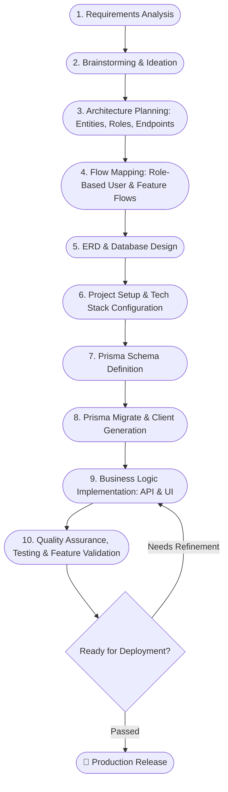

# 🚀 Project Development Roadmap: From Beginning to Completion

A comprehensive, industry-standard development roadmap based on structured software engineering principles. This guide outlines the end-to-end lifecycle of a full-stack project—from initial requirement analysis and database modeling to implementation, testing, and delivery.

---

## 📌 Roadmap Overview Flowchart



---

## 📑 Step-by-Step Implementation Guide

### 1. 📋 Read & Analyze Requirements Thoroughly
* **Objective**: Gain a 360-degree understanding of what needs to be built and why.
* **Key Activities**:
  - Read project briefs, Client Requirement Specifications (CRS), or User Stories.
  - Separate **Functional Requirements** (what the system should do) from **Non-Functional Requirements** (performance, security, scalability, availability).
  - Identify project boundaries, constraints, deadlines, and deliverables.
  - Document assumptions and clarify ambiguities early with stakeholders.

---

### 2. 💡 Brainstorming & Solution Ideation
* **Objective**: Formulate the optimal technical and architectural solutions to solve the identified problems.
* **Key Activities**:
  - Explore alternative technical approaches and trade-offs.
  - Assess potential technical bottlenecks (e.g., concurrency, third-party API rate limits, storage needs).
  - Identify edge cases and failure modes (e.g., payment failures, network drops, race conditions).
  - Select the high-level system architecture (e.g., Monolithic vs. Microservices, Serverless vs. Long-running servers).

---

### 3. 📝 Note Down Core Entities, Roles, Features & Endpoints
* **Objective**: Break down high-level ideas into concrete software components and specifications.
* **Key Components**:
  - **Entities / Models**: Identify core domain objects (e.g., `User`, `Profile`, `Product`, `Order`, `Payment`, `Review`).
  - **Roles & Permissions (RBAC)**: Define user access levels (e.g., `SUPER_ADMIN`, `ADMIN`, `VENDOR`, `CUSTOMER`).
  - **Feature List**: Categorize features into *Must-Have* (MVP), *Should-Have*, and *Nice-to-Have*.
  - **API Contract Design**: Draft endpoint routes following RESTful conventions:
    - `POST /api/v1/auth/register` - Create account
    - `POST /api/v1/auth/login` - Authenticate
    - `GET /api/v1/users/me` - Profile data
    - `GET /api/v1/orders` - Retrieve list of orders
    - `POST /api/v1/orders` - Place order

---

### 4. 🔀 Map Project & User Flows
* **Objective**: Visualize step-by-step journeys for each user role and system interaction.
* **Key Activities**:
  - **Authentication Flow**: Registration $\rightarrow$ Email verification $\rightarrow$ Login $\rightarrow$ Access & Refresh Token generation.
  - **Role-Based Workflows**:
    - **Customer Flow**: Browse catalog $\rightarrow$ Add to cart $\rightarrow$ Checkout $\rightarrow$ Payment $\rightarrow$ Order confirmation.
    - **Admin Flow**: Dashboard overview $\rightarrow$ Manage catalog $\rightarrow$ Update order status $\rightarrow$ View analytics.
  - **System Events & Side Effects**: Notification triggers, invoice emails, background jobs, external webhook handling.

---

### 5. 🗄️ ERD Design & Database Architecture
* **Objective**: Structure relational data models for performance, data integrity, and normalization.
* **Key Activities**:
  - Draw an **Entity-Relationship Diagram (ERD)** using tools like draw.io, Eraser.io, or dbdiagram.io.
  - Define primary keys (`id`), foreign keys, and indexes for fast querying.
  - Identify relationships:
    - **One-to-One (1:1)**: `User` $\leftrightarrow$ `Profile`
    - **One-to-Many (1:N)**: `User` $\leftrightarrow$ `Order`, `Category` $\leftrightarrow$ `Product`
    - **Many-to-Many (N:M)**: `Order` $\leftrightarrow$ `Product` (via join table `OrderItem`)
  - Set cascade behaviors (e.g., `onDelete: Cascade` vs. `Restrict`).

---

### 6. ⚙️ Project Setup with Chosen Tech Stack
* **Objective**: Initialize a clean, robust, and scalable project foundation.
* **Key Activities**:
  - Initialize version control (`git init`, `.gitignore`).
  - Select and initialize frameworks (e.g., Node.js/Express, NestJS, Next.js).
  - Configure code quality tooling:
    - **TypeScript** (`tsconfig.json`) for type safety.
    - **ESLint & Prettier** for standardized formatting.
    - Standard directory structure (e.g., `src/modules/`, `src/controllers/`, `src/services/`, `src/middlewares/`).
  - Set up environment variables (`.env`, `.env.example`).

---

### 7. 💎 Prisma Schema Models Definition
* **Objective**: Translate your ERD design into code using the declarative Prisma schema.
* **Key Activities**:
  - Configure `schema.prisma` datasource and generator:
    ```prisma
    datasource db {
      provider = "postgresql"
      url      = env("DATABASE_URL")
    }

    generator client {
      provider = "prisma-client-js"
    }
    ```
  - Define models with appropriate field types, relations, defaults, and constraints:
    ```prisma
    enum Role {
      ADMIN
      USER
    }

    model User {
      id        String    @id @default(uuid())
      email     String    @unique
      password  String
      role      Role      @default(USER)
      createdAt DateTime  @default(now())
      updatedAt DateTime  @updatedAt
      orders    Order[]
    }
    ```

---

### 8. 🔄 Prisma Migrate & Generate
* **Objective**: Apply database schema changes to the database and generate type-safe database access client.
* **Key Commands**:
  - Create and apply migration:
    ```bash
    npx prisma migrate dev --name init
    ```
  - Generate/update Prisma Client:
    ```bash
    npx prisma generate
    ```
  - *(Optional)* Seed initial data (e.g., admin user, default categories):
    ```bash
    npx prisma db seed
    ```
  - Inspect database via Prisma Studio:
    ```bash
    npx prisma studio
    ```

---

### 9. 💻 Implement Business Logic (Backend & Frontend)
* **Objective**: Build out application features following clean coding practices and modular architecture.
* **Backend Implementation**:
  - **Route $\rightarrow$ Controller $\rightarrow$ Service $\rightarrow$ Data Access**:
    - **Routes**: Define URL paths and apply middlewares.
    - **Controllers**: Handle request validation and HTTP responses.
    - **Services**: House the core business logic, calculations, and data transformation.
  - **Validation**: Validate inputs with schemas (e.g., Zod, Joi).
  - **Security**: Password hashing (bcrypt/argon2), JWT token validation, rate-limiting, CORS configuration.
  - **Global Error Handling**: Catch and normalize all errors into consistent JSON responses.
* **Frontend Implementation**:
  - Reusable component architecture and layout design.
  - Client-side routing and protected route guards based on user role.
  - API integration using fetch wrappers / TanStack React Query / Axios.
  - Form management, client validation, loading states, and toast notifications.

---

### 10. 🧪 Verification, Testing & Feature Quality Assurance
* **Objective**: Ensure the software is bug-free, performs reliably, and fulfills all initial requirements.
* **Key Activities**:
  - **Manual & API Testing**: Verify all endpoints and edge cases via Postman, Thunder Client, or Bruno.
  - **Unit & Integration Testing**: Write automated test suites (e.g., Jest, Vitest, Supertest) for critical business logic.
  - **Role & Authorization Checks**: Verify that restricted endpoints cannot be accessed by unauthorized users.
  - **Cross-Browser & Responsive Testing**: Ensure the frontend renders properly on mobile, tablet, and desktop viewports.
  - **Refactoring & Code Review**: Remove dead code, optimize database queries, ensure no security vulnerabilities or exposed secrets.

---

## 📊 Summary Checklist

| # | Stage | Primary Output | Recommended Tools |
|---|---|---|---|
| 1 | **Requirements** | Scope Document / User Stories | Notion, Jira, Google Docs |
| 2 | **Brainstorming** | Architecture Notes & Edge Cases | FigJam, Miro, Obsidian |
| 3 | **Architecture & Roles** | Role Matrix & API Contracts | Swagger/OpenAPI, Markdown |
| 4 | **Flow Mapping** | User Journey & Flow Diagrams | Mermaid, Lucidchart, Whimsical |
| 5 | **ERD & DB Design** | Entity Relationship Diagram | dbdiagram.io, Eraser, draw.io |
| 6 | **Project Setup** | Configured Repository & Boilerplate | Node.js, TypeScript, Git |
| 7 | **Prisma Schema** | `schema.prisma` definitions | Prisma, PostgreSQL / MySQL |
| 8 | **Prisma Migrate** | Migration files & Generated Client | Prisma CLI, Prisma Studio |
| 9 | **Business Logic** | Working Backend APIs & Frontend UI | Express/NestJS, Next.js/React, Zod |
| 10 | **Testing & QA** | Verified & Validated Production Build | Postman, Vitest, Jest, Playwright |

---

*Authored following the Software Development Life Cycle (SDLC) best practices.*
